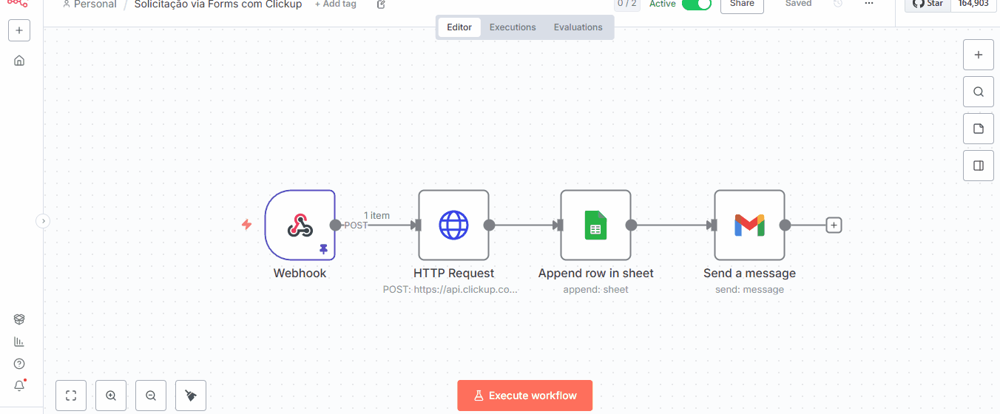

📌 Automação de Solicitação Operacional

Este projeto apresenta uma automação end-to-end desenvolvida para transformar solicitações operacionais enviadas via Google Forms em tarefas estruturadas no ClickUp, com registro automático em planilha e notificação por e-mail em HTML.

A solução utiliza n8n em ambiente self-hosted, integrado ao Google Apps Script (JavaScript), com foco em padronização, rastreabilidade e redução de atividades manuais em ambientes corporativos.

🎯 Objetivo

Centralizar solicitações operacionais em um único fluxo automatizado, garantindo:

Padronização das informações

Criação automática de tarefas

Registro histórico das solicitações

Comunicação imediata com os envolvidos

🧩 Tecnologias Utilizadas

Google Forms – Coleta das solicitações

Google Sheets – Registro e histórico dos dados

Google Apps Script (JavaScript) – Captura do evento onFormSubmit e envio via Webhook

n8n (Self-hosted) – Orquestração da automação

ClickUp API REST – Criação automática de tarefas

Gmail – Envio de notificações em e-mail HTML

🔄 Fluxo da Automação

Etapas do Fluxo

O usuário envia a solicitação via Google Forms

O Google Apps Script captura o evento onFormSubmit

Os dados são enviados via Webhook para o n8n

O n8n processa as informações e cria automaticamente uma tarefa no ClickUp

Os campos da tarefa são formatados com Markdown e emojis

A solicitação é registrada automaticamente no Google Sheets

Um e-mail HTML de notificação é enviado com os dados da solicitação

🧠 Lógica em JavaScript (Google Apps Script)

A automação utiliza Google Apps Script (JavaScript) para:

Gerar um número único de chamado, reiniciado automaticamente a cada ano

Capturar os dados enviados pelo Google Forms

Enviar os dados estruturados via Webhook para o n8n

📌 Geração do Número de Chamado

Formato gerado automaticamente:

AAAA-0001
Exemplo: 2025-0001

📜 Código Utilizado
function gerarNumeroChamado() {
  const props = PropertiesService.getScriptProperties();
  const anoAtual = new Date().getFullYear();

  const ultimoAno = props.getProperty('ULTIMO_ANO');
  let sequencial = Number(props.getProperty('SEQUENCIAL')) || 0;

  // Se mudou o ano, zera o contador
  if (ultimoAno !== String(anoAtual)) {
    sequencial = 0;
    props.setProperty('ULTIMO_ANO', String(anoAtual));
  }

  sequencial++;
  props.setProperty('SEQUENCIAL', String(sequencial));

  // Formato: 2025-0001
  return `${anoAtual}-${String(sequencial).padStart(4, '0')}`;
}

function onFormSubmit(e) {
  const row = e.values;

  const numeroChamado = gerarNumeroChamado();

  const payload = {
    numero_chamado: numeroChamado,
    nome: row[2],
    tipo: row[3],
    descricao: row[4],
    prioridade: row[5]
  };

  UrlFetchApp.fetch(
    'https://SEU-ENDPOINT-N8N/webhook/solicitacao-operacional',
    {
      method: 'post',
      contentType: 'application/json',
      payload: JSON.stringify(payload),
      muteHttpExceptions: true
    }
  );
}

📝 Estrutura da Tarefa no ClickUp

👤 Solicitante

📝 Descrição detalhada da solicitação

⚠️ Prioridade, destacada visualmente com emojis

🎯 Diferenciais do Projeto

Integração real entre múltiplas plataformas

Uso de Webhooks em ambiente self-hosted

Numeração automática de chamados por ano

Criação automática de tarefas via ClickUp API

Registro histórico das solicitações

Notificação por e-mail com layout profissional

Padronização visual das informações

Pronto para uso em ambiente corporativo

🔐 Segurança

Tokens, URLs reais e IDs sensíveis foram removidos

Uso de placeholders para publicação em repositório público

Nenhuma credencial sensível versionada

📌 Possíveis Evoluções

SLA automático com base na prioridade

Notificações adicionais (WhatsApp / Telegram)

Dashboard de acompanhamento das solicitações

Atribuição automática de responsáveis

Integração com sistemas internos (ERP / ITSM)

💡 Observação

Projeto desenvolvido com foco em boas práticas de automação, clareza operacional e aplicabilidade real, sendo ideal para demonstração em portfólio profissional, especialmente para vagas de RPA Developer, Automation Engineer e n8n Specialist.
