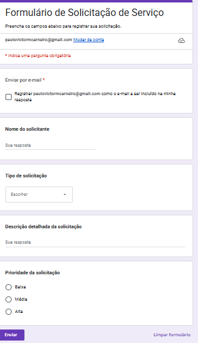

📌 Automação de Solicitação Operacional

Automação end-to-end que transforma solicitações operacionais enviadas via Google Forms em tarefas estruturadas no ClickUp, com registro automático em planilha e notificação por e-mail em HTML.

A solução foi desenvolvida utilizando n8n (self-hosted) e Google Apps Script (JavaScript), com foco em padronização, rastreabilidade e eficiência operacional.

🎯 Objetivo do Projeto

Centralizar solicitações operacionais em um fluxo único e automatizado, garantindo:

Padronização das informações

Criação automática de tarefas

Histórico auditável das solicitações

Comunicação imediata com os envolvidos

🧩 Tecnologias Utilizadas

Google Forms

Google Sheets

Google Apps Script (JavaScript)

n8n (Self-hosted)

ClickUp API REST

Gmail (HTML Email)

🔄 Visão Geral da Automação

Demonstração do fluxo completo da automação em execução.

1️⃣ Envio da Solicitação

O usuário preenche o formulário operacional.

2️⃣ Captura e Processamento

O Google Apps Script captura o evento onFormSubmit, gera o número do chamado e envia os dados ao n8n via Webhook.

3️⃣ Criação da Tarefa no ClickUp

O n8n processa os dados recebidos e cria automaticamente a tarefa no ClickUp.

4️⃣ Detalhamento e Padronização

A tarefa é criada com campos padronizados, utilizando Markdown e emojis para facilitar a leitura.

5️⃣ Notificação por E-mail

Após a criação da tarefa, um e-mail HTML profissional é enviado com os dados da solicitação.

🧠 Lógica em JavaScript (Google Apps Script)

O Google Apps Script é responsável por:

Gerar um número único de chamado por ano

Capturar os dados enviados pelo Google Forms

Enviar os dados estruturados ao n8n

📌 Padrão do Número do Chamado
AAAA-0001
Exemplo: 2025-0001

📜 Código Principal
function gerarNumeroChamado() {
  const props = PropertiesService.getScriptProperties();
  const anoAtual = new Date().getFullYear();

  const ultimoAno = props.getProperty('ULTIMO_ANO');
  let sequencial = Number(props.getProperty('SEQUENCIAL')) || 0;

  if (ultimoAno !== String(anoAtual)) {
    sequencial = 0;
    props.setProperty('ULTIMO_ANO', String(anoAtual));
  }

  sequencial++;
  props.setProperty('SEQUENCIAL', String(sequencial));

  return `${anoAtual}-${String(sequencial).padStart(4, '0')}`;
}

function onFormSubmit(e) {
  const row = e.values;
  const numeroChamado = gerarNumeroChamado();

  const payload = {
    numero_chamado: numeroChamado,
    nome: row[2],
    tipo: row[3],
    descricao: row[4],
    prioridade: row[5]
  };

  UrlFetchApp.fetch(
    'https://SEU-ENDPOINT-N8N/webhook/solicitacao-operacional',
    {
      method: 'post',
      contentType: 'application/json',
      payload: JSON.stringify(payload),
      muteHttpExceptions: true
    }
  );
}

📝 Estrutura da Tarefa no ClickUp

👤 Solicitante

📝 Descrição detalhada

⚠️ Prioridade com destaque visual

⭐ Diferenciais do Projeto

Integração real entre múltiplas plataformas

Webhooks em ambiente self-hosted

Numeração automática de chamados

Criação automática de tarefas via API

Registro histórico centralizado

Notificação por e-mail profissional

Layout pensado para operação real

🔐 Segurança

Nenhuma credencial sensível versionada

Tokens e URLs substituídos por placeholders

Projeto seguro para repositório público

🚀 Possíveis Evoluções

SLA automático por prioridade

Notificações via WhatsApp / Telegram

Dashboard gerencial

Atribuição automática de responsáveis

💡 Observação Final

Projeto desenvolvido com foco em automação corporativa real, boas práticas de integração e clareza operacional, sendo ideal para portfólio técnico em vagas de RPA Developer, Automation Engineer e n8n Specialist.
