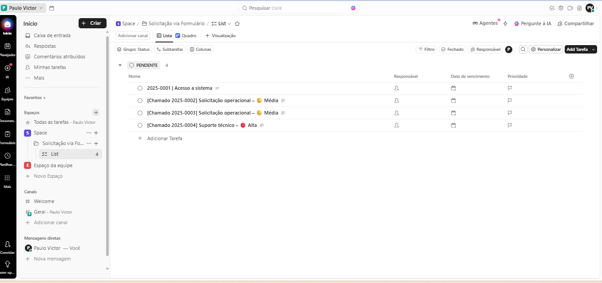

📌 Automação de Solicitação Operacional

Este projeto apresenta uma automação end-to-end desenvolvida para transformar solicitações operacionais enviadas via Google Forms em tarefas estruturadas no ClickUp, com registro automático em planilha e notificação por e-mail em HTML.

A solução utiliza n8n self-hosted integrado ao Google Apps Script, com foco em padronização, rastreabilidade e redução de atividades manuais em ambientes corporativos.

🎯 Objetivo

Centralizar solicitações operacionais em um único fluxo automatizado, garantindo:

Padronização das informações

Criação automática de tarefas

Registro histórico das solicitações

Comunicação imediata com os envolvidos

🧩 Tecnologias Utilizadas

Google Forms – Coleta das solicitações

Google Sheets – Registro e histórico dos dados

Google Apps Script – Captura do evento onFormSubmit

n8n (Self-hosted) – Orquestração da automação

ClickUp API REST – Criação automática de tarefas

Gmail – Envio de notificações em e-mail HTML

🔄 Fluxo da Automação

O usuário envia uma solicitação via Google Forms

O Google Apps Script captura o evento onFormSubmit

Os dados são enviados via Webhook para o n8n

O n8n processa as informações e cria uma tarefa no ClickUp

Os campos da tarefa são formatados com Markdown e emojis

A solicitação é registrada automaticamente no Google Sheets

Um e-mail HTML de notificação é enviado com os dados da solicitação

📝 Estrutura da Tarefa no ClickUp

👤 Solicitante

📝 Descrição detalhada da solicitação

⚠️ Prioridade, destacada visualmente com emojis

🎯 Diferenciais do Projeto

Integração real entre múltiplas plataformas

Uso de Webhooks em ambiente self-hosted

Criação automática de tarefas via ClickUp API

Registro histórico das solicitações em planilha

Notificação por e-mail com layout profissional

Padronização visual das informações

Projeto pronto para uso em ambiente corporativo

🔐 Segurança

Tokens, URLs reais e IDs sensíveis foram removidos

Uso de placeholders para publicação em repositório público

Nenhuma credencial sensível versionada

📌 Possíveis Evoluções

SLA automático com base na prioridade

Notificações adicionais (WhatsApp / Telegram)

Dashboard de acompanhamento das solicitações

Atribuição automática de responsáveis

Integração com sistemas internos (ERP / ITSM)

💡 Observação

Projeto desenvolvido com foco em boas práticas de automação, clareza operacional e aplicabilidade real, sendo ideal para demonstração em portfólio profissional, especialmente para vagas de RPA Developer, Automation Engineer e n8n Specialist.
